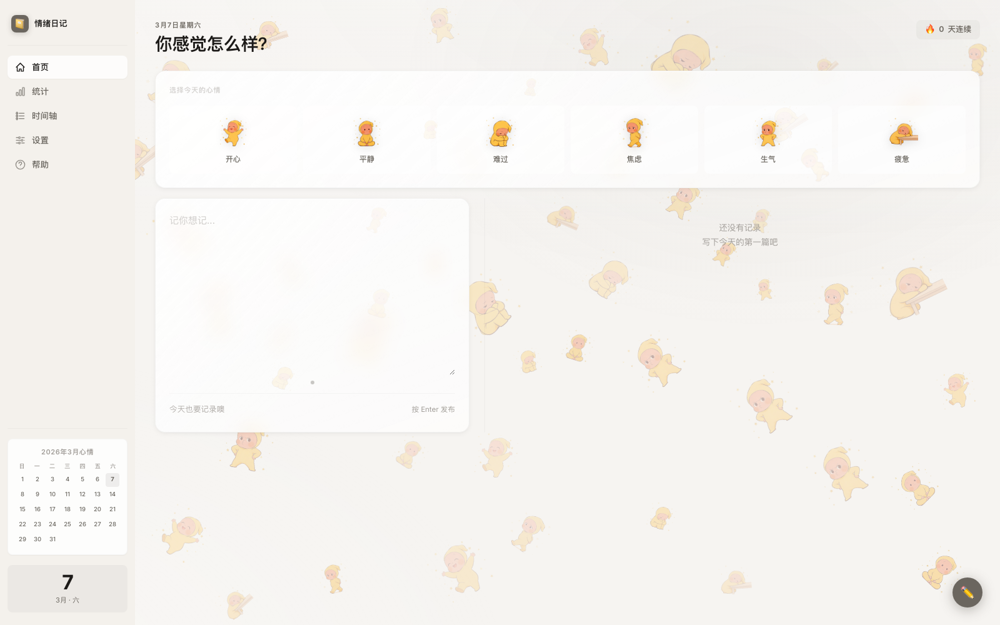

# 情绪日记（小白 vibecoding 练手）

这是我用 `HTML + CSS + JavaScript` 做的一个非常基础的小项目。  
定位就是：`小白练手`、`先跑起来`、`能用就行`。



首页长这样：一个轻量、直观、没有复杂操作的情绪记录页。

## 先说清楚

- 这是一次个人 `vibecoding` 尝试，不是专业级产品
- 代码主要放在一个 `index.html` 里，结构比较直接
- 功能不复杂，重点是把完整流程走通（记录 -> 查看 -> 备份）

## 这个小东西能做什么

- 选一个当天情绪（开心、平静、难过、焦虑、生气、疲惫）
- 写一段当天感受并保存
- 在时间轴看历史记录
- 在统计页看简单趋势
- 导出/导入 JSON 备份数据

## 技术栈（很朴素）

- HTML
- CSS
- 原生 JavaScript（无框架、无后端）

## 为什么说它很简单

- 没有登录系统
- 没有数据库
- 没有服务端 API
- 没有复杂工程化配置
- 数据只存在浏览器本地 `localStorage`

## 本地运行

1. 克隆仓库

```bash
git clone https://github.com/leeli53/emotion-diary.git
cd emotion-diary
```

2. 运行方式（二选一）

- 直接双击打开 `index.html`
- 或本地起一个静态服务：

```bash
python3 -m http.server 8080
```

3. 打开浏览器

```text
http://localhost:8080
```

## 项目结构

```text
emotion-diary/
├── assets/      # 情绪图片
├── index.html   # 主页面（样式和脚本都在这里）
└── README.md
```

## 数据说明

- 默认存储键：`moodDiary_v5`
- 数据保存在当前浏览器本地，不会自动上传
- 建议定期使用“导出数据 (JSON)”做备份

## 开发碎碎念

- 这是我一边查一边做出来的，很多地方都很“新手写法”
- 一开始只想做“能记录今天心情”这一个点，后来才慢慢补了统计和导入导出
- 代码没有追求花哨架构，主要是为了让我自己能看懂、能改动
- 如果你也在学前端，希望这个小项目能给你一点点开始动手的勇气

## 如果你也是小白

这个项目很适合拿来改着玩，比如：

- 多加几种情绪
- 给每条日记加标签
- 调整页面配色和排版
- 把单文件拆成多个文件（HTML/CSS/JS）
